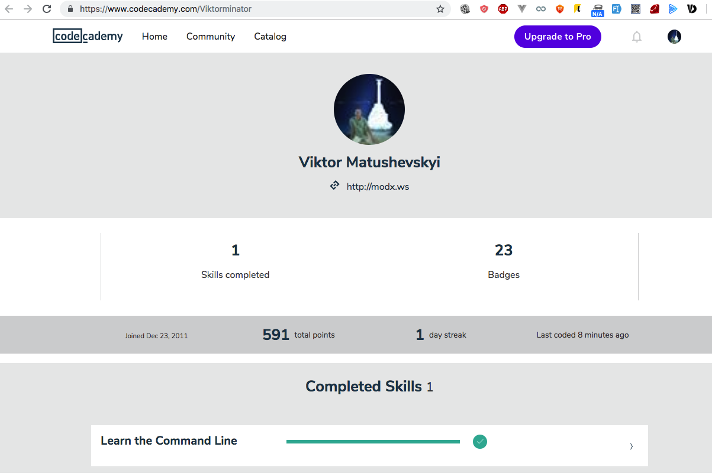
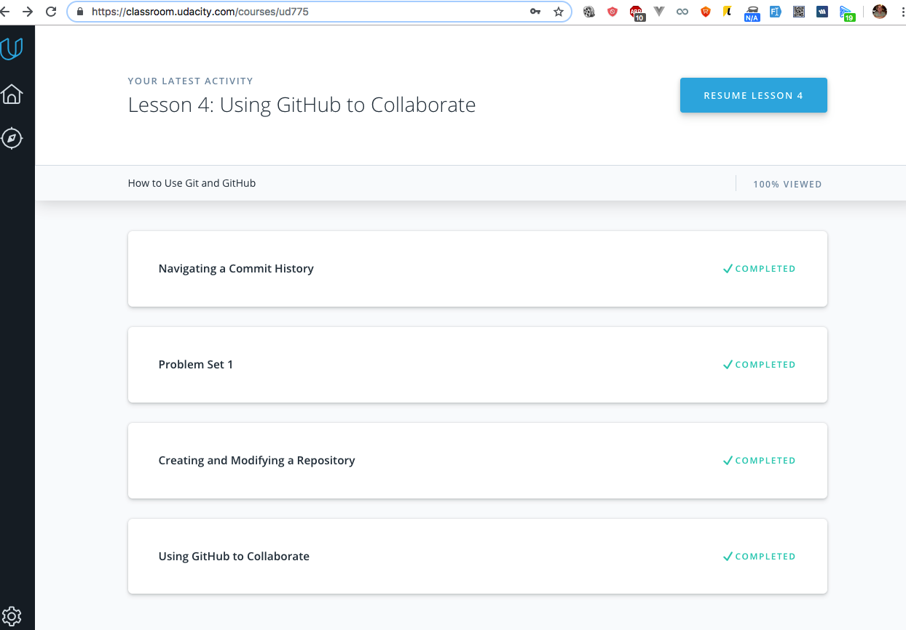
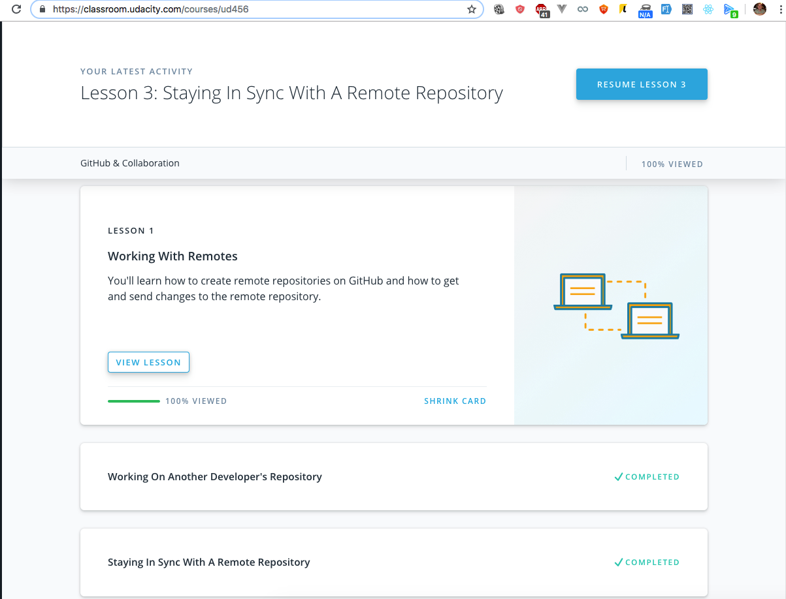
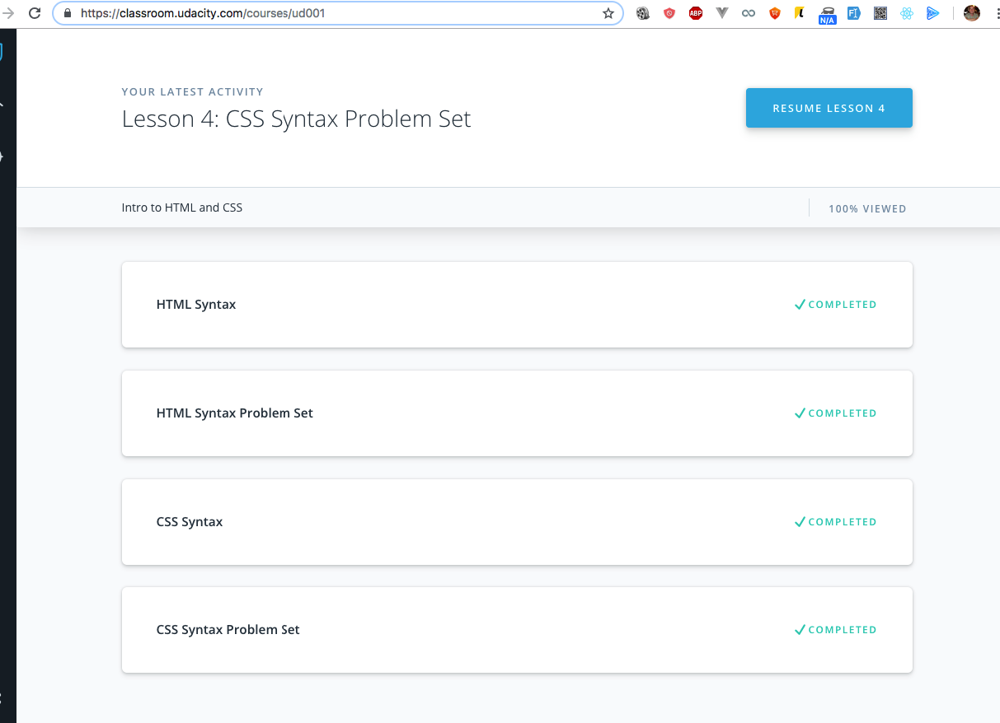

# kottans-frontend

 - [x] Git intro
 - [x] Linux CLI, HTTP
 - [x] Git for Team Collaboration
 - [x] Front-End Basics
 - [ ] Responsive Layouts
 - [ ] JavaScript Basics
 - [ ] Document Object Model
 - [ ] Building a Tiny JS World (pre-OOP) - practice
 - [ ] Object-Oriented JavaScript - practice
 - [ ] OOP exercise - practice
 - [ ] Offline Web Applications - _optional_
 - [ ] Memory – Pair Game - practice
 - [ ] Website Performance Optimization - _optional_
 - [ ] Friends App - practice

## Linux CLI, and HTTP

I've not expected that this CLI course will be useful to me, because I've been dealing with cli & terminal for a very long time from now. I have learned new things! Level up!

## Git Collaboration

Nice course, will recommend this to other developers.

## Intro to HTML and CSS

Nothing really new to me.
